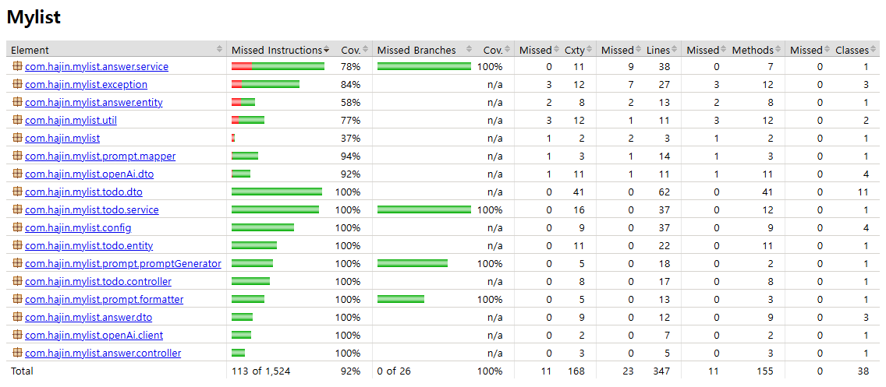

# 🧾My list: To Do & Calender API
---

### ✔️ 핵심 기능
- 사용자가 **날짜별로 To Do**를 등록하고, AI가 그날 일정 수행을 돕기 위해 **필요한 준비사항**을 알려주는 앱입니다.

### ✔️ 목적
- **하루의 생산성**을 높이고, 사용자가 할 일을 효과적으로 수행할 수 있도록 **AI 기반의 가이드**를 제공합니다.

---
## 💻 2. 소스 빌드 및 실행 메뉴얼

```bash
# 프로젝트 빌드 (Gradle)
./gradlew build

# 애플리케이션 실행
Run Application

# Docker Compose 실행 (프로젝트 내부 etc의 README를 참고하세요)
cd etc
docker compose up -d
```

**Open API key 사용 안내**
보안 문제로 레포지토리에 API 키를 제거하였으므로, 메일로 제공된 API KEY를 사용해주세요.
```
# application.properties
openai.api.key= <email로 제공된 API KEY>
```


---
## 📄 3. 라이브러리 
| 라이브러리              | version        | 라이브러리 주요 용도              | 비고 |
|-------------------------|----------------|----------------------------------|------|
| spring-boot-data-jpa    | -              | JPA를 활용한 데이터베이스 처리     |      |
| spring-boot-web         | -              | 웹 애플리케이션 개발              |      |
| lombok                  | -              | 코드 간소화를 위한 애노테이션 제공 |      |
| mysql-connector-j       | -              | MySQL 데이터베이스 연결           |      |
| spring-boot-test        | -              | 테스트 관련 기능 제공             |      |
| junit-platform-launcher | -              | JUnit 플랫폼 테스트 실행 지원      |      |
| springdoc-openapi-ui    | 2.3.0          | Swagger를 사용한 OpenAPI 문서화    |      |
| openai-api              | 0.18.2         | OpenAI GPT API 사용              |      |
| openai-client           | 0.18.2         | OpenAI GPT API 클라이언트 구현     |      |
| json                    | 20240303       | JSON 데이터 처리                 |      |
| spring-boot-redis       | -              | Redis와의 데이터 처리 지원         |      |
| spring-boot-cache       | -              | 캐시 기능 지원                   |      |
| jackson-databind        | -              | JSON 데이터 바인딩               |      |
| jackson-jsr310          | -              | Java 8 날짜와 시간 객체 지원       |      |


---
## 📄 4. API 명세서
| **Action**                   | **API**                           | **Parameter**                              | **Body**                                                                                                                                          | **Response**                                                                                                                                                                |
|------------------------------|-----------------------------------|-------------------------------------------|--------------------------------------------------------------------------------------------------------------------------------------------------|--------------------------------------------------------------------------------------------------------------------------------------------------------------------------|
| **특정 To Do의 AI 응답 조회** | GET `/api/answers/{toDoId}`       | `toDoId` (PathVariable, Long)             | 없음                                                                                                                                               | `{ "status": "success", "message": "AI 응답 조회 성공", "data": [{ "toDoTitle": "Task Title", "answers": ["Answer 1", "Answer 2"] }] }`                                    |
| **프롬프트 생성 및 AI 응답 저장** | POST `/api/answers/generate`      | 없음                                       | `{ "date": "2024-12-20" }`                                                                                                                       | `{ "status": "success", "message": "응답이 성공적으로 저장되었습니다.", "data": null }`                                                                                    |
| **To Do 작성**               | POST `/api/todo`                  | 없음                                       | `{ "title": "Sample Task", "description": "Task description", "dueDate": "2024-12-12" }`                                                         | `{ "status": "success", "message": "작성이 완료되었습니다.", "data": { "id": 1 } }`                                                                                       |
| **To Do 수정**               | PUT `/api/todo/{id}`              | `id` (PathVariable, Long)                 | `{ "title": "Updated Task", "description": "Updated description", "dueDate": "2024-12-15", "completed": true }`                                  | `{ "status": "success", "message": "수정이 완료되었습니다.", "data": null }`                                                                                              |
| **To Do 단건 조회**          | GET `/api/todo/{id}`              | `id` (PathVariable, Long)                 | 없음                                                                                                                                               | `{ "status": "success", "message": "조회 성공", "data": { "id": 1, "title": "Sample Task", "description": "Task description", "dueDate": "2024-12-12", "completed": false } }` |
| **To Do 삭제**               | DELETE `/api/todo/{id}`           | `id` (PathVariable, Long)                 | 없음                                                                                                                                               | `{ "status": "success", "message": "항목이 삭제되었습니다.", "data": null }`                                                                                              |
| **To Do 전체 조회**          | GET `/api/todo/alltodo`           | 없음                                       | 없음                                                                                                                                               | `{ "status": "success", "message": "전체 조회 성공", "data": [{ "id": 1, "title": "Task 1", "description": "Description 1", "dueDate": "2024-12-12", "completed": false }] }` |
| **특정 날짜의 To Do 조회**    | POST `/api/todo/bydate`           | 없음                                       | `{ "date": "2024-12-12" }`                                                                                                                       | `{ "status": "success", "message": "조회 성공", "data": [{ "title": "Task 1", "description": "Description 1", "dueDate": "2024-12-12", "completed": false }] }`             |
| **To Do 완료 여부 수정**      | PATCH `/api/todo/{id}/completed`  | `id` (PathVariable, Long)                 | `{ "completed": true }`                                                                                                                           | `{ "status": "success", "message": "수정이 완료되었습니다.", "data": null }`                                                                                              |


---
## 🤖 5. 추가 기능 설명
### ✔️ 기능 설명  
Open AI의 GPT 모델을 활용하여 사용자의 To Do 데이터를 기반으로 **맞춤형 준비사항을 생성**하고 관리하는 기능 
### ✔️ 기능의 목적
단순한 To Do 관리에서 확장되어, 사용자가 To Do를 더 효과적으로 준비하고 실행할 수 있도록 지원하는 것을 목표로 합니다. 
AI 기반의 준비사항 생성은 사용자의 할 일을 분석하고, 맞춤형 준비 가이드를 제공함으로써 생산성과 효율성을 높여줍니다.

| **기능** | **설명** |
|----------|----------|
| 프롬프트 생성 | To Do 데이터를 기반으로 AI가 처리할 수 있는 프롬프트를 생성합니다. |
| AI 호출 | 생성된 프롬프트를 OpenAI API에 전달하고, JSON 형식의 응답을 받습니다. |
| 응답 저장 | AI 응답 데이터를 Answer 엔티티로 저장하여 데이터베이스에 기록합니다. |

### 📜 sequence-diagram


---
## 🛠️ 6. Test Coverage


---
## 🛠️ 7. 기술 스택 

| **분류**       | **기술 스택**       |
|----------------|--------------------|
| **애플리케이션 개발** | JAVA 17, JDK Zulu 21, Spring Boot 3.4.0 |
| **데이터 관리** | MySQL, JPA/Hibernate |
| **테스트**     | JUnit, Mockito      |
| **문서화 도구** | Swagger             |
| **환경 관리**  | Docker, Redis       |


## ✉️ 8. contact
- Back-end Developer 권하진
- email: amm_321@naver.com
